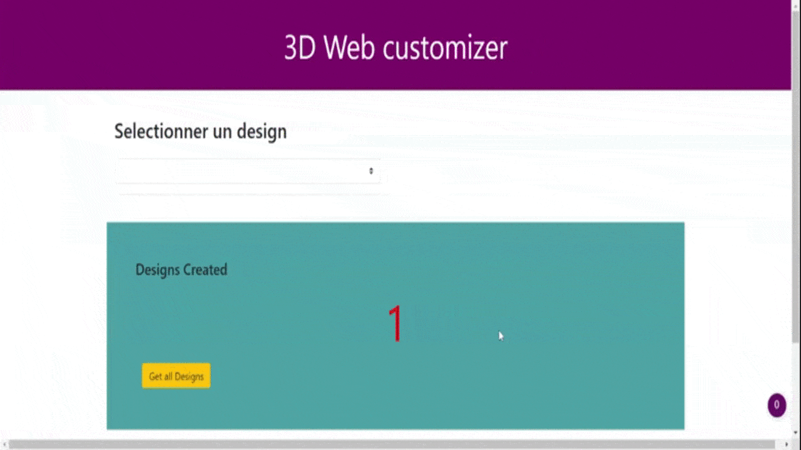

Permet de générer des fichiers 3d à partir de designs paramétrique


[[_TOC_]]

## Configuration
Pour configurer l'application et ajouter de nouveaux designs, il faut modifier le fichier [`./api/config3DModels.json`](./api/config3DModels.json)

Le serveur appel le fichier jscad [`./api/jscadfiles/name_plate.jscad`](./api/jscadfiles/name_plate.jscad), ce fichier permet alors de génerer les formulaires html qui correspondent (`type: text || number `, `label: label à afficher`, ...)

```
    {
        "id": "name_plate",
        "label": "Badge",
        "fileName": "name_plate.jscad",
        "params": {
            "name": {
                "default": "Zinedine",
                "type":"text",
                "label": "Nom"
            },
            "title": {
                "default": "Zidane",
                "type":"text",
                "label": "Titre"
            },
            "thickness": {
                "default": 3.0,
                "type":"number",
                "label": "Epaisseur"
            }
        }
    }
```

## Front application
Folder : `my-app/`

### Install
`npm install`

### Launch
`npm run serve`

### dependencies
- [VueJS](https://vuejs.org/)
- [BootstrapVue](https://bootstrap-vue.org/)
- [vue3dModel](https://github.com/hujiulong/vue-3d-model)


## Backoffice application
Folder : `api/`

### Install
`npm install`

### Launch
`npm run dev`

### Js dependencies
- [ExpressJS](https://expressjs.com/fr/)
- [openjscad](https://github.com/jscad/OpenJSCAD.org)

## todo
- rendre l'application compatible avec Openscad aussi (actuellement, ça fonctionne uniquement avec OpenJsCad)
- débusquer tout les bugs
- Clean du code